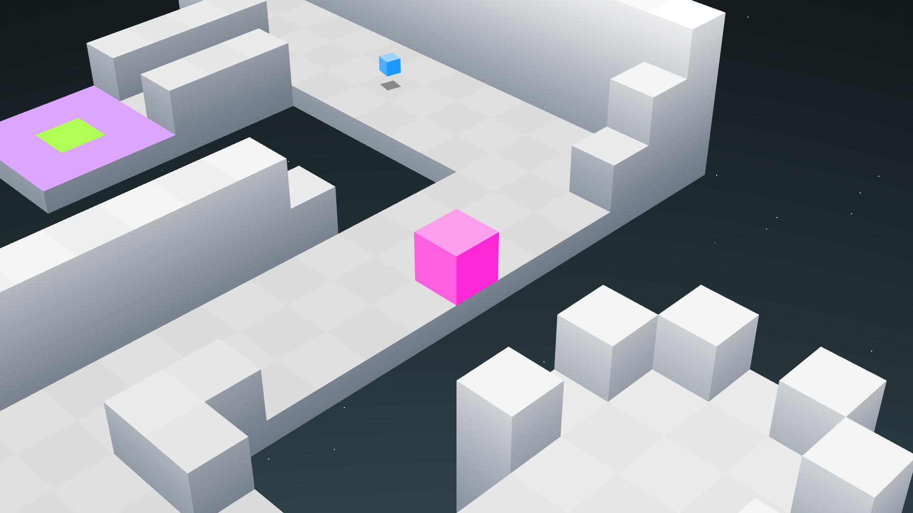

Code is under GPL-3.
Textures & Music/SFX from [EDGE](https://store.steampowered.com/app/38740/EDGE/).
Font from Earthbound.



## Building

### Linux

This program depends on libglew, libsfml, and libgl.
On a debian-based system, these dependencies can be installed using the following command:
```
sudo apt install libglew-dev libgl-dev libsfml*
```
Once the dependencies are installed, use `make` in the project directory to build the program.

## Options

When launching the program, you can pass `-v` to enable VSync, and `-f` to enable fullscreen.

When playing, you can press F10 for general frame stats, and CTRL+F12 for debug info.
